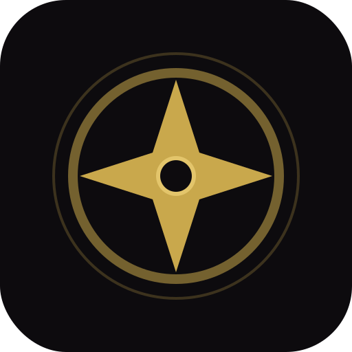

# The Chronicle — a private macro & nutrition codex

A local-first, subscription-free nutrition tracker in the spirit of MacroFactor, with a
Terraria-style game UI. Everything runs in your browser and stays on your device: no backend, no
account, no fees. Your data is yours — export it any time.



## What it does

**Logging**
- Food search across **Open Food Facts** (no key needed) and **USDA FoodData Central**
  (works out of the box with `DEMO_KEY`; add your own free key in Settings for higher limits)
- **Barcode scanning** with the device camera (UPC/EAN — native `BarcodeDetector` when available,
  ZXing fallback, torch toggle, manual digit entry as a last resort)
- Custom foods with full macro + micronutrient breakdown, saved permanently to your personal codex
- **Recipe builder** — combine ingredients, set servings, log a portion as one entry
- Quick add (calories/macros only), per-meal logging with custom meal categories,
  copy previous day, copy a past entry to today
- Water tracking with a daily target

**Adaptive targets — the core**
- Baseline TDEE from **Mifflin-St Jeor**, **Harris-Benedict**, or **Katch-McArdle** (your choice)
- **Adaptive expenditure**: the app fits your logged intake against your real weight change
  (least-squares over up to 28 days) to learn your true TDEE — with a confidence score, a
  minimum two weeks of data before it takes over, and a *Show the math* panel exposing every number
- Goals: fat loss, muscle gain, recomposition, maintenance, each with a rate-of-change target
- Macro splits as percentages, absolute grams, or protein-per-pound
- Weekly **calorie cycling** (higher on training days, weekly total preserved)
- Coaching: when your trend drifts off your goal rate, it recommends a specific adjustment —
  and shows the arithmetic

**Progress**
- Daily weigh-ins with an exponentially smoothed **trend line** over raw dots
- Plain-English trend interpretation ("losing ~0.7 lb/week")
- Body measurements (waist, chest, arms…) with per-site graphs
- Progress photos tied to dates, estimated body fat (Navy tape / BMI methods)
- Weekly Ledger: average calories, average weight, trend direction, quest progress

**Analytics**
- Any range (week / month / 3 months / all): averages vs targets with variance,
  calorie history, macro composition, calories by meal, micronutrients
  (fiber, sugar, sodium, potassium, cholesterol, vitamins…), estimated glycemic load,
  most-logged foods, protein per lb of bodyweight
- **Feats** — game-style achievements ("First Bite!", "Iron Discipline"), streaks, XP and levels

**Your data**
- Stored in IndexedDB on your device; settings in localStorage
- One-click JSON backup (restorable) and CSV export of food log + weights
- Installable **PWA** — works offline after first load

## Use it on the web

The app deploys automatically to GitHub Pages on every push to `main`:

**https://sleepingesram-dev.github.io/macro-recorder/**

**Install it** (it's a PWA — installs like a native app, works offline after first load):
- **Android / Chrome:** open the URL → browser menu (⋮) → *Add to Home screen* / *Install app*
- **iPhone / Safari:** open the URL → Share button → *Add to Home Screen*
- **Desktop Chrome/Edge:** click the install icon in the address bar

Being on HTTPS also means camera barcode scanning works from your phone.

## Running it locally

```bash
npm install
npm run dev          # development, http://localhost:5173
```

Production build (what you'd host or install as a PWA):

```bash
npm run build
npm run preview      # serves dist/ at http://localhost:4173
```

> **Camera note:** barcode scanning requires a secure context — `localhost` or HTTPS.
> Any static host (or `npm run preview` on your machine) works. Manual barcode entry
> works everywhere.

To use it on your phone: host `dist/` anywhere static (or run `npm run preview -- --host`
on your computer and open your computer's address from the phone), then "Add to Home Screen."

## Stack

React 18 · Vite · Tailwind (custom Terraria-style token system) · Dexie (IndexedDB) · Recharts ·
Framer Motion · ZXing · vite-plugin-pwa. Fonts (Press Start 2P / Pixelify Sans / VT323) ship with the app —
no external requests except the two food databases.

Design tokens and the validated chart palette are documented in [`docs/DESIGN.md`](docs/DESIGN.md).

## Privacy

No analytics, no accounts, no server. Network requests happen only when you search foods or
scan a barcode (Open Food Facts / USDA), and responses are cached for offline reuse.
